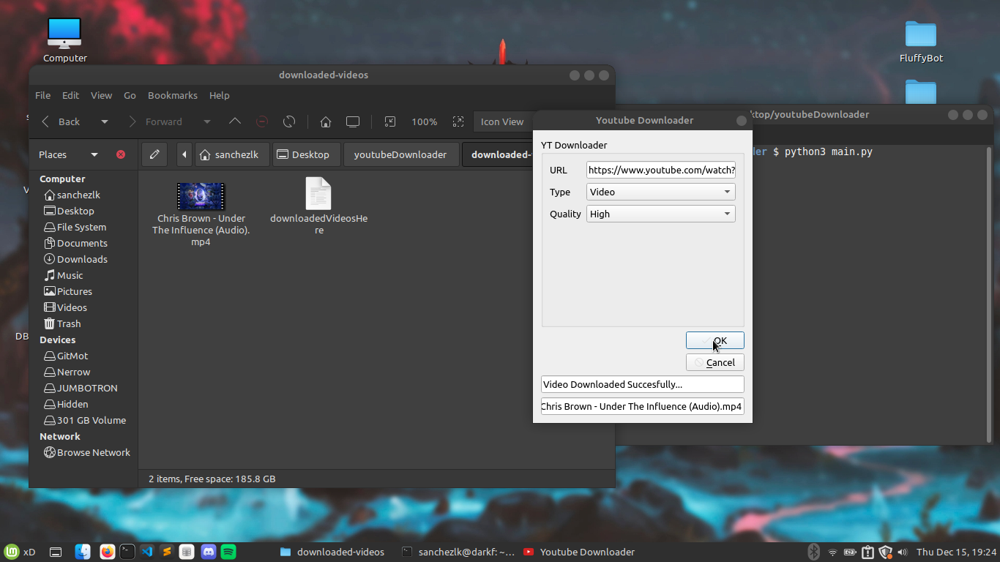

### Youtube Video Downloader

#### Python

 

 

 

 

##### Used Tools

<code>
PyQt5
</code>
<code>
Pytube
</code>

### How to Use

<code>Clone the project</code>  
<code>cd into project folder && open folder from terminal and run:</code>  
<code>python3 main.py</code>  
 

&copy; All rights reserved by <a href="https://sithika.vercel.app" target="_blank">Sithika Dangampala</a>
